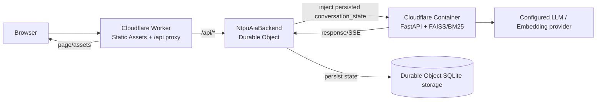
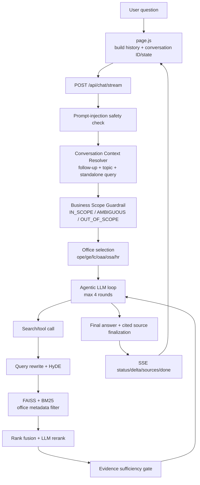

# NTPU AI 智慧問答助理 Baseline SDD

> 文件狀態：Phase A baseline（導入 SYSTEM FAQ 前）
> 原始碼基準：`main@a7e324c`
> 盤點日期：2026-08-27
> 原則：本文件只描述 repository 中可驗證的實作；不以線上說明頁推測架構。

## 1. 目的與邊界

本文件記錄 `a7e324c` 的實際系統設計，回答以下核心問題：

> 使用者送出一個問題後，實際經過哪些前端、API、對話解析、範圍與處室路由、檢索、模型與來源整理程序，最後如何回到前端？

此 baseline 包含六個校務知識域：

| 代碼 | 單位 | baseline 資料範圍 |
| --- | --- | --- |
| `ope` | 體育室 | 網站頁面、公告、FAQ、法規、競賽與部分表單 |
| `ge` | 通識教育中心 | 公告、FAQ、含頁碼法規內容 |
| `lc` | 語言中心 | 公告、FAQ、含頁碼法規內容 |
| `oaa` | 教務處 | 法規辦法全文 |
| `osa` | 學務處 | 法規辦法全文 |
| `hr` | 人事室 | FAQ 與法規相關內容 |

此版本尚無獨立 `SYSTEM` 知識域。像「你可以回答什麼？」這類系統自我說明問題，會進入原有 scope guardrail，因此可能被判成模糊或不在六處室範圍內；這正是 Phase B 要補上的缺口。

## 2. 系統架構

### 2.1 元件

| 層級 | 實際技術與檔案 | 責任 |
| --- | --- | --- |
| Frontend | Next.js 16、React 19、Tailwind CSS；`front_end/sports-ai-chat/app/page.js` | Chat UI、中英文介面、快速問題、SSE 串流、圖片與語音輸入、來源與回饋顯示 |
| About Page | 靜態 HTML；`front_end/sports-ai-chat/public/about.html` | 系統特色、使用方式、服務範圍與架構說明 |
| Edge/API Gateway | Cloudflare Worker；`cf/src/index.js` | 提供靜態資源，將 `/api/*` 轉送至後端 Container，保存每個 conversation 的狀態 |
| Backend | Python 3.11、FastAPI；`agentic_v2_5_4high.py` | API、guardrail、路由、RAG、agentic tool loop、來源整理、語音與圖片處理 |
| Conversation Guardrail | `conversation_guardrail.py` | 對話解析、standalone query、scope tri-state、處室選擇、state 更新、evidence gate |
| LLM Adapter | `llm_adapter.py` | OpenAI／Ollama provider 抽象、大小模型與 tool-calling 事件格式 |
| Retrieval | FAISS、BM25、OpenAI embeddings、LLM rewrite／HyDE／rerank | 六處室混合檢索與處室 metadata 過濾 |
| Knowledge Base | `crawler_data/`、`corrections.md`、法規 metadata 檔 | 官方網站與 PDF 經爬取／OCR／整理後的 Markdown 與來源 URL metadata |
| Deployment | Cloudflare Workers、Static Assets、Containers、SQLite-backed Durable Object | 同一 Worker 對外提供前端與 API，Container 執行 FastAPI/FAISS，Durable Object 保存對話狀態 |

### 2.2 正式部署拓撲



正式環境不是「GCP Cloud Run 前後端兩個獨立服務」。`cf/wrangler.jsonc` 定義 `aia.ntpu.ai` custom domain、Workers Static Assets、Container binding 與 Durable Object；`.github/workflows/deploy.yml` 會在 push `main` 後預建 FAISS、輸出 Next.js 靜態網站，再執行 Wrangler deploy。GCP/Cloud Run 只存在於舊部署說明與遷移紀錄，不是此 baseline 的 production topology。

## 3. 完整 Query Flow

### 3.1 文字問題（SSE 主流程）



實際步驟：

1. `page.js` 產生／沿用 `sessionId`，從 `sessionStorage` 取出 `conversation_state` 與最近 20 則可見訊息，還原畫面並送出最近對話 history。
2. Cloudflare Worker 對 `/api/*` 取得 singleton `NtpuAiaBackend` Durable Object。若 request 未帶完整 state，Worker 由 Durable Object storage 補入該 conversation 的 JSON state。
3. FastAPI `/api/chat/stream` 建立 `message_id` 與 request context，呼叫 `prepare_conversation_turn()`。
4. safety guardrail 先檢查 prompt injection。
5. `resolve_conversation()` 使用結構化 JSON 解析本輪是否追問、是否換題、standalone query、topic、繼承處室與信心。
6. `run_scope_guardrail()` 判斷 `IN_SCOPE`、`AMBIGUOUS` 或 `OUT_OF_SCOPE`。
7. `select_office()` 依本輪處室提示、追問繼承與 confidence 選出六處室代碼。
8. 模糊問題直接回澄清問題；out-of-scope 直接回服務範圍訊息；in-scope 才進入 agentic RAG。
9. `synthesize_agentic_answer_stream()` 建立動態 system prompt，帶最近最多 8 則 history、standalone query、scope 與 office。
10. Agent 最多執行 4 輪；最後一輪禁止再呼叫工具並強制作答。
11. 一般知識檢索由 `tool_search_database()` 呼叫 `retrieve_and_rerank()`，預設取 6 筆。
12. 回答生成後，只保留被答案引用或與答案最相關的候選來源，形成 `sources`。
13. 後端依序送出 SSE `status`、`delta`、`sources`、`done`；`done` 含 answer、message ID、conversation ID 與更新後 state。
14. Worker 將 response 中的 `conversation_state` 寫回 Durable Object storage；前端同步把 state 與最近 20 則可見訊息寫入 `sessionStorage`。

### 3.2 非串流、圖片與語音

- `POST /api/chat`：與主流程相同，但一次回傳完整 JSON；圖片 base64 分支直接進 vision model，不走六處室 Router/RAG。
- `POST /api/voice`：先以 Whisper 相容模型轉錄，再把文字送入同一 conversation guardrail 與 RAG；可嘗試產生 TTS base64 回覆。
- 圖片追問有獨立的圖片歷史／vision prompt；目前不與六處室文件檢索合併。

## 4. Router 與 Guardrail

### 4.1 Baseline 分類

Baseline 的業務分類只有 `ope`、`ge`、`lc`、`oaa`、`osa`、`hr`，另以 `other`／`chat` 作 backward-compatible 回傳；沒有 `SYSTEM`。

### 4.2 判斷順序

1. Safety：regex/heuristic prompt-injection check。
2. Conversation resolver：LLM structured JSON；失敗時使用 history、短追問 marker 與 state 的 deterministic fallback。
3. Scope guardrail：LLM structured JSON + lexical fallback，輸出 tri-state 與 `office_hint`。
4. Office selection：優先本輪明確 office；高信心同主題追問可繼承 `active_office`。

### 4.3 Conversation State schema

```json
{
  "conversation_id": "string",
  "active_office": "ope|ge|lc|oaa|osa|hr|null",
  "active_topic": "string|null",
  "scope_verified": true,
  "previous_user_query": "string|null",
  "previous_standalone_query": "string|null",
  "previous_source_ids": ["string"],
  "conversation_summary": "string|null",
  "last_updated_at": "ISO-8601 string"
}
```

Client state 與最近訊息只做 UX cache；正式跨 request 的結構化 state source of truth 是 Worker Durable Object storage。Worker 會限制 key、型別、字串長度與 source ID 數量。若前端只有舊 state 而沒有可還原的可見訊息，會建立新的 conversation ID，避免隱藏上下文。

### 4.4 Fallback

- resolver/provider 失敗：以 active topic、history、關鍵詞與 follow-up marker 產生 standalone query。
- scope `AMBIGUOUS`：要求使用者補充，而非直接當 out-of-scope。
- agent loop 失敗：再做一次 `top_k=5`、不 rerank 的檢索；evidence 足夠才整理結果。
- evidence 不足：明確說資料不足，不允許模型猜測。

## 5. RAG 設計

### 5.1 Ingestion 與 Chunk

- 網站爬取結果與 PDF/OCR 結果先存成 Markdown。
- `parse_all_content()` 解析頁面、最新消息與 FAQ；`parse_regulations_content()`／`parse_dept_regulations()` 解析文件與頁碼。
- 長公告與法規使用 `RecursiveCharacterTextSplitter`：`chunk_size=800`、`chunk_overlap=150`，分隔順序為附件標題、標題、空行、換行、空白。
- FAQ 以完整 `Q/A` 建一筆 document；短公告保留完整內容。
- 每筆 document 加上 `doc_id`，並保留處室與來源 metadata。

### 5.2 Metadata

視資料類型使用下列欄位：

```text
dept, type, page, title, url, category, date, doc_id
```

法規 metadata 會以整理檔／xlsx 對應官方 URL。若資料源沒有 URL，前端只顯示來源標題，不生成假連結。

### 5.3 Embedding 與索引

- 預設 embedding model：`text-embedding-3-small`，可由 `EMBEDDING_MODEL` 覆寫。
- embedding batch `chunk_size=100`；`EMBEDDING_MAX_RETRIES` 預設 8。
- 六處室 documents 建成同一個 FAISS index，依 `dept` metadata 在 retrieval 時過濾。
- `.faiss_cache` 以資料檔 MD5 fingerprint、pickle documents 與 FAISS files 快取；CI 會盡量在映像建置前預建。

### 5.4 Hybrid Search 與 Rerank

1. 原始 standalone query。
2. LLM rewrite 為 3–5 個中文檢索短句。
3. HyDE 產生約 80 字關鍵摘要。
4. 去重後最多 5 個 query variants。
5. FAISS vector search；有處室 filter 時先取 `top_k * 3` 再過濾。
6. BM25 使用中文字串 bigram 與英文 lowercase token。
7. 以 reciprocal-rank 型分數 `1 / (60 + rank)` 融合候選。
8. 同主題追問可先加入上一輪 source documents，再以 stable source ID 去重。
9. 候選前 10 筆交給小模型以 0–3 relevance score rerank；JSON 解析失敗則保留原順序。

主要 Top-K：

| 呼叫點 | Top-K |
| --- | --- |
| `retrieve_and_rerank()` 預設 | 8 |
| 一般 `tool_search_database()` | 6 |
| agent exception backup | 5，且不做 rerank |

### 5.5 Evidence 與 Sources

`check_evidence_sufficiency()` 以 query 與 document 的詞彙重疊、文件存在性等 deterministic 規則判斷是否足以回答。檢索工具將文件登記成 request-local 候選；答案完成後再依標題／URL 引用與相關性縮減，對前端輸出：

```json
{
  "title": "來源標題",
  "url": "https://official.example/path"
}
```

## 6. Knowledge Base

| 單位 | 主要 repository 資料 |
| --- | --- |
| 體育室 | `crawler_data/all_content_v2.md`、`crawler_data/ALL_files_2.md`、`file_index.json` |
| 通識教育中心 | `crawler_data/cge_content.md`、`crawler_data/ge_regulations_extra.md` |
| 語言中心 | `crawler_data/lc_content.md` |
| 教務處 | `crawler_data/oaa_regulations.md` + 行政法規 URL metadata |
| 學務處 | `crawler_data/osa_regulations.md` + 行政法規 URL metadata |
| 人事室 | `crawler_data/hr_content.md`、`crawler_data/hr_regulations.md` |
| 總務處 | `crawler_data/oga_content.md`、`crawler_data/oga_regulations.md` |
| 跨處室人工修正 | `corrections.md`，以 `dept` metadata 保持處室隔離 |

資料更新分成三件事，不應混為一談：

1. 更新 crawler/PDF 產出的 source files。
2. 依 content fingerprint 重建 FAISS 與 BM25。
3. 經 GitHub Actions 建置並部署新的 Worker/Container。

`python knowledge_source_audit.py` 會逐處室比對 XLSX 彙整表與實際 Markdown 正文；
缺檔、只有標題／連結、或仍含抽取失敗標記時會回傳失敗。

程式內有 `auto_update()` 排程函式，但 production 是否啟用不能只因函式存在就推定；正式可驗證的更新路徑是 repository 更新後由 CI 重建與部署。

## 7. Models 與 Prompt

| 用途 | 實作 |
| --- | --- |
| Agent 主模型 | `llm_adapter.MODEL_BIG`，預設 OpenAI `gpt-5.4-mini` |
| Resolver、scope、rewrite、rerank 等 | `llm_adapter.MODEL_SMALL` 或 adapter completion，預設 `gpt-4o-mini` |
| Embedding | 預設 `text-embedding-3-small` |
| 語音辨識 | OpenAI audio/Whisper 相容 API |
| 圖片理解 | OpenAI-compatible vision model；可由環境變數調整 |

模型 provider 可由 `LLM_PROVIDER` 在 OpenAI 與 Ollama 間切換。Prompt 明確限制回答語系、處室角色、可用工具、不得混用不同處室資料、evidence 不足不得猜測。

## 8. API Contract

### 8.1 Chat request

`POST /api/chat` 與 `POST /api/chat/stream`：

```json
{
  "question": "string",
  "history": [{"role": "user|assistant", "content": "string"}],
  "session_id": "legacy string",
  "conversation_id": "string",
  "conversation_state": {},
  "image_base64": "optional string"
}
```

### 8.2 JSON response

成功：

```json
{
  "status": "ok",
  "answer": "string",
  "sources": [{"title": "string", "url": "string"}],
  "message_id": "string",
  "conversation_id": "string",
  "conversation_state": {},
  "scope_status": "IN_SCOPE|AMBIGUOUS|null"
}
```

阻擋：`status=blocked` 並使用 `message`；錯誤：`status=error`。

### 8.3 SSE response

`/api/chat/stream` 以 `data: <json>\n\n` 回傳事件：

- `status`：檢索／工具執行提示。
- `delta`：回答文字增量。
- `sources`：最終來源陣列。
- `done`：完整 answer、message/conversation ID、state 與 scope status。
- `blocked`／`error`：終止訊息。

### 8.4 其他 endpoints

- `POST /api/voice`
- `POST /api/feedback`
- `GET /api/health`

## 9. Frontend

- 單頁 Chat UI；桌機側欄與行動版 header。
- 中／英文顯示文字與快速問題清單。
- `Enter` 送出、`Shift+Enter` 換行，保護中文輸入法 composing 狀態。
- SSE 串流狀態、逐字內容、來源、回饋按鈕。
- 圖片上傳、語音錄製、語音播放。
- light/dark theme。
- About page 為 `public/about.html`，build 後直接成為 `/about.html`／`/about` 靜態資源。
- Next config 使用 static export；正式 API URL 為空字串，前端以同源 `/api/*` 呼叫。

## 10. Deployment

### 10.1 Build/Deploy

1. push `main` 觸發 `.github/workflows/deploy.yml`。
2. Python 3.11 安裝 runtime requirements，使用 GitHub secret `OPENAI_API_KEY` 預建 `.faiss_cache`。
3. Node 22 執行 `npm ci` 與 `next build`，驗證 `out/index.html`。
4. Wrangler 使用 GitHub 的 Cloudflare credentials 部署 Worker 與 Container。
5. Worker Secret 提供 Container runtime 的 `OPENAI_API_KEY`。

### 10.2 Runtime

- Worker name：`ntpu-aia-api`。
- Custom domain：`aia.ntpu.ai`。
- Static Assets directory：`front_end/sports-ai-chat/out`。
- Container：一個 `standard-1` instance 上限，`sleepAfter=30m`。
- Container command：Uvicorn 啟動 `agentic_v2_5_4high:app`，port 8080。
- Conversation persistence：SQLite-backed Durable Object storage。

### 10.3 主要環境變數／Secrets

| 名稱 | 用途 |
| --- | --- |
| `OPENAI_API_KEY` | LLM、embedding、audio；production 為 Worker Secret，CI 另有 GitHub Actions secret |
| `OPENAI_BASE_URL` | OpenAI-compatible endpoint |
| `LLM_PROVIDER` | `openai` 或 `ollama` |
| `MODEL_BIG` / `MODEL_SMALL` | 主／輔助模型 |
| `EMBEDDING_MODEL` | embedding model |
| `EMBEDDING_MAX_RETRIES` | embedding API retry |
| `ALLOWED_ORIGINS` | FastAPI CORS allowlist |
| `VISION_FOLLOWUP_MODEL` | 圖片追問模型 |
| `REASONING_EFFORT` | agent reasoning 設定 |

## 11. Tests

Baseline repository 可驗證的測試：

| 類型 | 檔案／方式 | 內容 |
| --- | --- | --- |
| Conversation router regression | `tests/test_conversation_guardrail.py` | 追問、換題、處室繼承、resolver fallback、evidence contract |
| FastAPI integration | `tests/test_chat_endpoint_flow.py` | 同一 conversation 的 LC 追問仍保持 scope/office |
| Frontend lint/build | `npm run lint`、`npm run build` | React/Next 靜態輸出 |
| CI smoke | workflow 的 cache 與 `out/index.html` 檢查 | 索引與前端產物存在 |

目前沒有獨立的 retrieval relevance benchmark，也沒有涵蓋所有六處室的 browser E2E；這些是後續測試可補強的缺口。

## 12. Phase B Extension Point

SYSTEM FAQ 應插在「conversation resolution 之後、六處室 scope/office routing 之前」，且只在高信心 SYSTEM intent 時 bypass 六處室 RAG。若原 scope 結果為 `OUT_OF_SCOPE`，可再做一次較高 threshold 的 SYSTEM fallback；仍無匹配才回不支援。這個位置能保留既有六處室 ingestion、FAISS、BM25、reranking、agent prompts 與 source pipeline。
